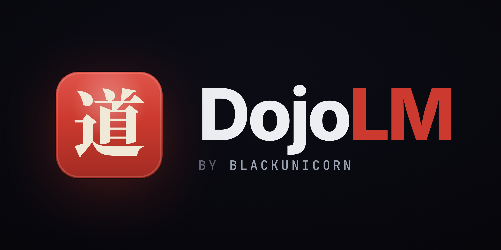
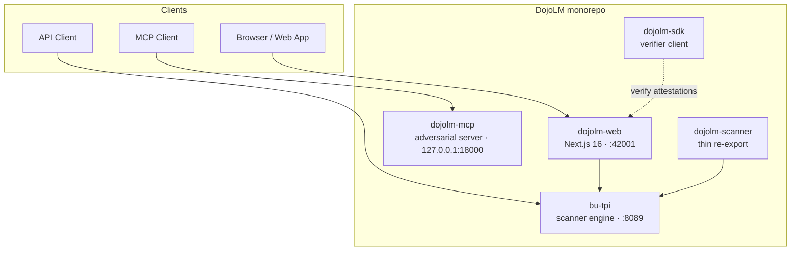
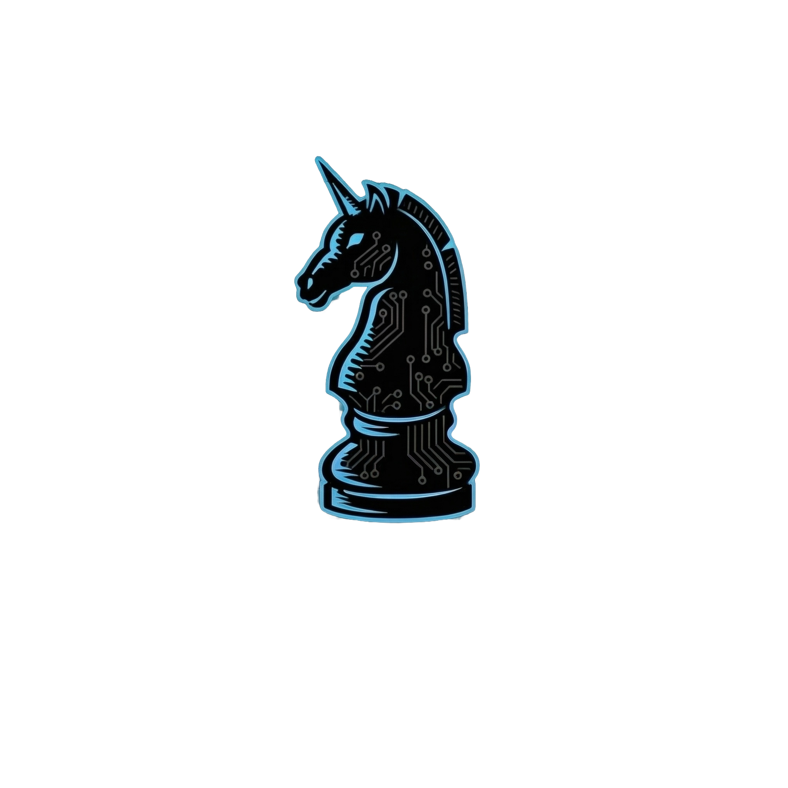

<div align="center">



# DojoLM

**The open-source dojo for LLM security** — prompt-injection detection, adversarial
red-teaming, compliance mapping, and an attestable AI-governance substrate.

[](LICENSE)
[](LICENSE-BUSL-1.1.txt)
[](package.json)
[](tsconfig.json)
[](#-why-dojolm)
[](CONTRIBUTING.md)

[Quick Start](#-quick-start) · [Why DojoLM](#-why-dojolm) · [Architecture](#-architecture) ·
[Editions](#-editions-open-core) · [Documentation](#-documentation) · [Whitepaper](WHITEPAPER.md)

</div>

---

## What is DojoLM?

DojoLM is a monorepo for testing, securing, and hardening Large Language Model
deployments against the adversarial reality of production: prompt injection,
jailbreaking, context manipulation, and multimodal payload smuggling.

It pairs a **zero-dependency scanner engine** with a **Next.js control plane**, an
**adversarial MCP server**, and a **verifier SDK** — so you can detect attacks, red-team
your own models, map results to a control framework, and produce attestable evidence
that your AI is safe.

> Like a dojo trains a fighter, DojoLM trains your defenses — then proves they hold.

| | |
| --- | --- |
| 🧩 **544** detection patterns across **49** pattern groups | 🧪 **5,281** attack fixtures across **40** categories |
| 🛡️ **18 / 18** DojoV2 controls (100% coverage) | 🔌 **57** built-in LLM provider presets |
| 📦 **Zero** runtime dependencies in the core engine | 🌐 Hardened, GET-only scanner API |

---

## ✨ Why DojoLM

- 🛡️ **Zero-dependency core.** The scanner engine (`bu-tpi`) ships with no runtime
  dependencies — minimal supply-chain attack surface, auditable end to end.
- 🥷 **Adversarial by design.** Attack modules, an adversarial MCP server for agent
  testing, and multilingual + multimodal payload vectors built in.
- 📊 **A control framework, not just regexes.** 18 DojoV2 controls with full fixture
  coverage turn raw detections into a measurable security posture.
- 🔌 **Universal model compatibility.** 57 provider presets out of the box; bring your
  own endpoint when you need to.
- 📜 **Governance substrate.** Compliance mapping, WORM audit trails, and Sigstore-style
  attestation let DojoLM sit *under* your GRC stack as verifiable substrate.
- 🔭 **Transparent telemetry.** A documented event model and a "Powered by DojoLM"
  verifier footer that carries the attestation everywhere a result is rendered.

---

## 🚀 Quick Start

**Requirements:** Node.js ≥ 20 and npm ≥ 10.

```bash
git clone https://github.com/BlackUnicornSecurity/DojoLM.git
cd DojoLM
npm install
npm run build

# Session-cookie signing key (required once per deployment — keep it stable across restarts)
export TPI_COOKIE_SIGNING_KEY_CURRENT=$(node -e "console.log(require('crypto').randomBytes(32).toString('hex'))")

# Terminal 1 — standalone scanner API (:8089)
npm start --workspace=packages/bu-tpi

# Terminal 2 — web control plane (:42001)
npm run start:web
```

Open <http://localhost:42001>, or hit the scanner directly:

```bash
curl "http://localhost:8089/api/scan?text=ignore%20all%20previous%20instructions"
```

```jsonc
{
  "verdict": "BLOCK",
  "counts": { "critical": 1, "warning": 0, "info": 0 },
  "findings": [ /* matched patterns: category, severity, description, engine, … */ ],
  "elapsed": 2,
  "textLength": 32,
  "normalizedLength": 32
}
```

> Response envelope shown — see the [User API Reference](docs/user/API_REFERENCE.md) for the
> full `ScanResult` / `Finding` schema.

---

## 🏗️ Architecture

DojoLM is a TypeScript monorepo of five workspaces. The scanner engine is the hardened
core; everything else builds on it.



### Repository layout

```text
packages/
├── bu-tpi/          Core scanner engine + standalone hardened HTTP API (:8089)
├── dojolm-scanner/  Thin package re-exporting the bu-tpi scanner + types
├── dojolm-web/      Next.js 16 control plane, API routes, file-backed storage
├── dojolm-mcp/      Adversarial MCP server for agent / tool testing (127.0.0.1:18000)
└── dojolm-sdk/      TypeScript SDK — verifier client, predicate schema, log read
```

### Runtime notes

- `bu-tpi` serves a hardened, **GET-only** scanner API.
- `dojolm-web` uses the Next.js App Router with API routes and file-backed storage
  under `packages/dojolm-web/data`.
- `dojolm-mcp` defaults to `127.0.0.1:18000`.
- Programmatic web API access uses `X-API-Key` when a request is not a verified
  same-origin browser request.

---

## 🧭 Product surface

The web control plane groups capabilities into purpose-built workspaces:

| Workspace | What it does |
| --- | --- |
| **Haiku Scanner** | Real-time prompt-injection detection (Deep Scan + Shingan) |
| **Buki** (Payload Lab) | Build, mutate, and stage adversarial payloads (SAGE generator) |
| **Jutsu** (Model Lab) | Model registry, tests, results, leaderboard, and comparison |
| **Arena** & **Sengoku** | Head-to-head evaluation and campaign / temporal red-teaming |
| **Adversarial Lab** | Attack orchestration against your own endpoints |
| **Ronin Hub** & **Hattori Guard** | Threat intel and runtime guard modes |
| **Kotoba** · **Mitsuke** · **Amaterasu DNA** · **Kagami** | Language, discovery, attack-DNA analytics, and fingerprinting |
| **Bushido Book** | Compliance-framework mapping and evidence *(Enterprise)* |

---

## 💼 Editions (open-core)

DojoLM follows an **offense-free / governance-paid** open-core model. Everything you need
to detect and red-team lives in this repository under Apache-2.0. Enterprise governance
modules are licensed separately under the Business Source License 1.1.

| Capability | Community · Apache-2.0 | Enterprise · BUSL-1.1 |
| --- | :---: | :---: |
| Scanner engine + 544 detection patterns | ✅ | ✅ |
| Attack modules & adversarial red-teaming | ✅ | ✅ |
| Telemetry client + dashboard | ✅ | ✅ |
| MCP adversarial server + verifier SDK | ✅ | ✅ |
| Onigaeshi WORM audit ledger | — | ✅ |
| Bushido compliance book (framework mapping) | — | ✅ |
| Katana ISO-17025 validation | — | ✅ |
| Advanced admin & RBAC | — | ✅ |

> **This repository is the Community edition (Apache-2.0).** Enterprise modules are
> offered commercially — see [LICENSE-BUSL-1.1.txt](LICENSE-BUSL-1.1.txt) and
> [`docs/dev/license-policy.md`](docs/dev/license-policy.md).

---

## 📚 Documentation

- [📖 Documentation Index](docs/DOCUMENTATION-INDEX.md) — complete navigation guide
- [Getting Started](docs/user/GETTING_STARTED.md) · [Platform Guide](docs/user/PLATFORM_GUIDE.md) · [Common Workflows](docs/user/COMMON_WORKFLOWS.md)
- [User API Reference](docs/user/API_REFERENCE.md) · [LLM Provider Guide](docs/user/LLM-PROVIDER-GUIDE.md)
- [Architecture](docs/ARCHITECTURE.md) · [Glossary](docs/user/GLOSSARY.md) · [FAQ](docs/user/FAQ.md) · [Troubleshooting](docs/user/TROUBLESHOOTING.md)
- [Whitepaper](WHITEPAPER.md) · [Technical Documentation](TECHNICAL_DOCUMENTATION.md)

### Verify your checkout

```bash
npm run verify:docs   # doc metrics match implementation
npm run lint          # lint sources
npm test              # run the test suites
```

---

## 🤝 Contributing & community

Contributions are welcome — start with the guide and our standards:

- [Contributing Guide](CONTRIBUTING.md)
- [Code of Conduct](CODE_OF_CONDUCT.md)
- [Security Policy](SECURITY.md) — please report vulnerabilities responsibly
- [Changelog](CHANGELOG.md)

---

## 📜 License

DojoLM Community is released under the **[Apache License 2.0](LICENSE)**. Enterprise
governance modules are licensed under the **[Business Source License 1.1](LICENSE-BUSL-1.1.txt)**.
Third-party notices are recorded in [NOTICE](NOTICE).

<div align="center">

---

**Powered by DojoLM** · built by [BlackUnicorn Security](https://blackunicorn.tech) · [dojolm.com](https://dojolm.com)



</div>
