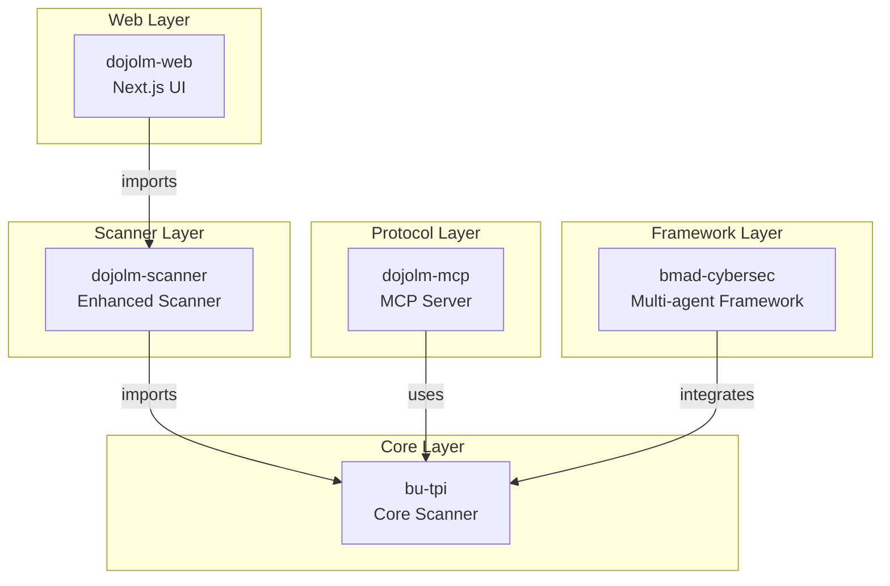

# NODA Platform Architecture

**Version:** 4.0 (NODA-3)
**Last Updated:** 2026-03-06

---

## Overview

NODA is a monorepo containing multiple packages for LLM security testing and red teaming. The platform provides 12 modules (NODA Dashboard, Haiku Scanner, Armory, Bushido Book, LLM Dashboard, Atemi Lab, The Kumite, Amaterasu DNA, Hattori Guard, Ronin Hub, LLM Jutsu, Admin) with a unified sidebar navigation. The architecture follows a layered approach with the core scanner at the bottom and web/UI layers on top.

---

## System Architecture

```
┌─────────────────────────────────────────────────────────────────────────┐
│                           External Access                                │
│                    (Browser, API Clients, MCP Clients)                   │
└─────────────────────────────────────────────────────────────────────────┘
                                    │
                    ┌───────────────┼───────────────┐
                    ▼               ▼               ▼
            ┌──────────────┐ ┌──────────────┐ ┌──────────────┐
            │  dojolm-web  │ │   bu-tpi     │ │  dojolm-mcp  │
            │  Port 3000   │ │  Port 8089   │ │  Port 3001   │
            │  (Next.js)   │ │  (HTTP API)  │ │  (MCP Server)│
            └──────┬───────┘ └──────┬───────┘ └──────┬───────┘
                   │                │                │
                   ▼                │                │
            ┌──────────────┐        │                │
            │dojolm-scanner│        │                │
            │  (Wrapper)   │────────┘                │
            └──────┬───────┘                         │
                   │                                 │
                   ▼                                 │
            ┌────────────────────────────────────────┴───────┐
            │                   bu-tpi                        │
            │              Core Scanner Engine                │
            │   505+ patterns | 47 groups | 6 detectors      │
            └────────────────────────────────────────────────┘
                                    │
                    ┌───────────────┼───────────────┐
                    ▼               ▼               ▼
            ┌──────────────┐ ┌──────────────┐ ┌──────────────┐
            │   Pattern    │ │   Fixture    │ │   Server     │
            │   Groups     │ │   Library    │ │   (serve.ts) │
            │  (47 groups) │ │ (1,544 files)│ │              │
            └──────────────┘ └──────────────┘ └──────────────┘
```

---

## Package Dependencies



---

## Package Details

### bu-tpi (Core Scanner)

**Location:** `packages/bu-tpi/`
**Port:** 8089
**License:** UNLICENSED (source-available)

The core detection engine with zero runtime dependencies.

```
packages/bu-tpi/
├── src/
│   ├── scanner.ts           # Detection engine
│   │   ├── Pattern groups   # 47 groups, 505+ patterns
│   │   ├── Heuristic detectors # 6 specialized detectors
│   │   ├── Text normalizer  # NFKC, homoglyphs, etc.
│   │   └── Verdict logic    # BLOCK/WARN/ALLOW
│   ├── serve.ts             # HTTP server
│   │   ├── /api/scan        # Text scanning
│   │   ├── /api/fixtures    # Fixture listing
│   │   ├── /api/stats       # Statistics
│   │   └── /api/run-tests   # Test execution
│   ├── types.ts             # Type definitions
│   ├── generate-fixtures.ts # Fixture generator
│   ├── audit/               # Audit logging
│   ├── compliance/          # Compliance framework
│   └── fuzzing/             # Fuzzing engine
├── fixtures/                # 1,544 attack artifacts
│   ├── images/              # EXIF, PNG, SVG
│   ├── audio/               # ID3, WAV, OGG
│   ├── web/                 # HTML, hidden text
│   ├── encoded/             # Base64, ROT13
│   ├── social/              # Social engineering
│   └── ...                  # 25+ more categories
└── tools/                   # Test utilities
```

### dojolm-scanner (Enhanced Scanner)

**Location:** `packages/dojolm-scanner/`
**License:** MIT

Web-friendly wrapper with engine filtering.

```
packages/dojolm-scanner/
├── src/
│   ├── scanner.ts           # Enhanced scanner API
│   │   ├── Engine filtering # Selective engine scanning
│   │   └── TypeScript types # Clean type exports
│   └── types.ts             # Type definitions
└── README.md
```

### dojolm-web (Web Interface)

**Location:** `packages/dojolm-web/`
**Port:** 3000
**License:** MIT

Next.js application with module-based architecture (12 modules via unified sidebar).

```
packages/dojolm-web/
├── src/
│   ├── app/                 # App Router pages
│   │   ├── page.tsx         # Single-page app with module routing
│   │   └── api/             # API routes
│   │       ├── scan/        # Haiku Scanner
│   │       ├── fixtures/    # Armory fixtures
│   │       ├── compliance/  # Bushido Book
│   │       ├── llm/         # LLM Dashboard & Jutsu
│   │       ├── ecosystem/   # Ecosystem findings
│   │       ├── ronin/       # Ronin Hub
│   │       ├── attackdna/   # Amaterasu DNA
│   │       ├── mcp/         # MCP status
│   │       └── admin/       # Admin health
│   ├── components/          # React components
│   │   ├── dashboard/       # NODA Dashboard & widgets
│   │   ├── scanner/         # Haiku Scanner
│   │   ├── fixtures/        # Armory (fixture browser)
│   │   ├── compliance/      # Bushido Book
│   │   ├── llm/             # LLM Dashboard
│   │   ├── adversarial/     # Atemi Lab
│   │   ├── strategic/       # The Kumite (SAGE, Arena, Mitsuke)
│   │   ├── attackdna/       # Amaterasu DNA
│   │   ├── guard/           # Hattori Guard
│   │   ├── ronin/           # Ronin Hub
│   │   ├── jutsu/           # LLM Jutsu
│   │   ├── admin/           # Admin panel
│   │   ├── layout/          # Sidebar, MobileNav, PageToolbar
│   │   └── ui/              # shadcn/ui, ConfigPanel, ModuleOnboarding, BeltBadge
│   └── lib/                 # Utilities
│       ├── api.ts           # API client
│       ├── constants.ts     # Module & engine constants
│       ├── contexts/        # GuardContext, EcosystemContext, LLMModelContext, etc.
│       ├── storage/         # guard-storage, ecosystem-storage
│       ├── data/            # baiss-framework, ronin-seed-programs
│       └── ablation-engine.ts # Black Box Analysis engine
├── public/                  # Static assets
└── e2e/                     # Playwright tests
```

### dojolm-mcp (MCP Server)

**Location:** `packages/dojolm-mcp/`
**Port:** 3001
**License:** MIT

Model Context Protocol server for AI agent testing.

```
packages/dojolm-mcp/
├── src/
│   ├── server.ts            # MCP JSON-RPC server
│   ├── attack-engine.ts     # Payload generation
│   ├── attack-controller.ts # Mode management
│   ├── tool-registry.ts     # Tool definitions
│   ├── virtual-fs.ts        # Sandboxed filesystem
│   └── types.ts             # Type definitions
└── README.md
```

### bmad-cybersec (Multi-agent Framework)

**Location:** `packages/bmad-cybersec/`
**License:** MIT

Production-ready multi-agent cybersecurity framework.

```
packages/bmad-cybersec/
├── config/                  # Agent configurations
├── framework/               # Core framework
├── validators/              # Security validators
├── memory/                  # Agent memory
└── README.md
```

---

## NODA Modules

The web interface provides 12 modules accessible via a unified sidebar navigation:

| Module | Component | Description |
|--------|-----------|-------------|
| **NODA Dashboard** | `NODADashboard` | Homepage with configurable widget grid (20+ widgets) |
| **Haiku Scanner** | `FindingsList`, `ModuleResults` | Real-time text scanning with pattern detection |
| **Armory** | `FixtureExplorer`, `FixtureCategoryCard` | 1,544+ test fixtures across 30+ categories |
| **Bushido Book** | `ComplianceCenter` | Compliance: Overview, Coverage, Gap Matrix, Audit Trail, Checklists; BAISS unified standard (32 controls, 10 categories, 6 frameworks) |
| **LLM Dashboard** | `LLMDashboard`, `ExecutiveSummary` | Multi-provider benchmarking with SSE streaming, SARIF export |
| **Atemi Lab** | `AdversarialLab`, `SkillsLibrary` | Adversarial testing with MCP connector, 40 skills, session recording |
| **The Kumite** | `StrategicHub` | Strategic hub: SAGE engine, Arena battles, Mitsuke threat feed |
| **Amaterasu DNA** | `AttackDNAExplorer`, `BlackBoxAnalysis` | Attack DNA: family tree, clusters, mutation timeline, ablation engine |
| **Hattori Guard** | `GuardDashboard` | Input/output protection — 4 modes: Shinobi (log), Samurai (block inputs), Sensei (block outputs), Hattori (full) |
| **Ronin Hub** | `RoninHub`, `ProgramsTab`, `SubmissionsTab` | Bug bounty platform with programs, submissions, CVE tracking |
| **LLM Jutsu** | `LLMJutsu`, `JutsuModelCard` | LLM testing command center with model cards, aggregation, comparison |
| **Admin** | `AdminPanel` | System health, API keys, export settings, scanner config |

Additional platform features:
- **Belt Color System** — White through Black (7 ranks by security score)
- **ConfigPanel** — Ubiquiti-style configuration panels for all modules
- **ModuleOnboarding** — 3-step onboarding wizard for each module
- **Cross-module Ecosystem** — Event bus for inter-module communication
- **1,358 tests** — 877 bu-tpi + 481 dojolm-web (Vitest)

---

## Data Flow

### Scan Request Flow

```
User Input ──► dojolm-web ──► dojolm-scanner ──► bu-tpi
                                                        │
                    ┌───────────────────────────────────┘
                    ▼
            ┌────────────────┐
            │ Text Normalizer│
            │ - NFKC         │
            │ - Zero-width   │
            │ - Homoglyphs   │
            └───────┬────────┘
                    ▼
            ┌────────────────┐
            │ Pattern Scanner│
            │ - 47 groups    │
            │ - 505+ patterns│
            └───────┬────────┘
                    ▼
            ┌────────────────┐
            │ Heuristics     │
            │ - Base64       │
            │ - HTML inject  │
            │ - Unicode      │
            │ - Encoding     │
            │ - Context      │
            │ - Math         │
            └───────┬────────┘
                    ▼
            ┌────────────────┐
            │ Verdict Engine │
            │ - BLOCK        │
            │ - WARN         │
            │ - ALLOW        │
            └───────┬────────┘
                    ▼
              ScanResult
```

### LLM Benchmark Flow

```
LLM Dashboard / LLM Jutsu ──► Fixture Selection ──► LLM Provider API
                                           │
                    ┌──────────────────────┘
                    ▼
            ┌────────────────┐
            │ LLM Response   │
            └───────┬────────┘
                    ▼
            ┌────────────────┐
            │ Scanner Check  │
            │ (Response)     │
            └───────┬────────┘
                    ▼
            ┌────────────────┐
            │ Scoring Engine │
            │ - Blocked      │
            │ - Warned       │
            │ - Allowed      │
            └───────┬────────┘
                    ▼
            ┌────────────────┐
            │ Results Export │
            │ - JSON         │
            │ - CSV          │
            │ - Report       │
            └────────────────┘
```

---

## Scanner Engine Details

### Pattern Groups (47 groups, 505+ patterns)

| Category | Groups | Patterns | TPI Coverage |
|----------|--------|----------|--------------|
| Core Injection | PI_PATTERNS | 33 | TPI-01 |
| Jailbreak | JB_PATTERNS | 66 | TPI-01 |
| Agent Output | AGENT_OUTPUT_PATTERNS | 5 | TPI-03 |
| Context | SETTINGS_WRITE, CONTEXT_* | 10+ | TPI-04, PRE-4 |
| Web | WEBFETCH, SEARCH_RESULT | 12 | TPI-02, TPI-05 |
| Multilingual | MULTILINGUAL_PATTERNS | 107 | TPI-15 |
| Code | CODE_FORMAT_PATTERNS | 13 | TPI-09 |
| Social | SOCIAL_PATTERNS | 15 | TPI-06/07/08 |
| Encoding | ENCODED_*, WHITESPACE_* | 21 | TPI-10/11/13/17 |
| Media | MEDIA_PATTERNS | 9 | TPI-18/19/20 |
| DoS | DOS_PATTERNS | 21 | OWASP LLM04 |
| Supply Chain | SUPPLY_CHAIN_PATTERNS | 26 | OWASP LLM05 |
| Vector/Embeddings | VEC_*_PATTERNS | 45 | OWASP 2025 |

### Heuristic Detectors (6 detectors)

| Detector | Purpose | TPI Coverage |
|----------|---------|--------------|
| Base64 Decoder | Decode and scan base64 content | TPI-10 |
| HTML Injection | Hidden text, CSS tricks | TPI-02 |
| Context Overload | Token flooding, many-shot | TPI-04 |
| Character Encoding | ROT13, ROT47, pig latin | TPI-11/13 |
| Math Encoding | Formal logic notation | TPI-13 |
| Hidden Unicode | Zero-width, confusables | TPI-17 |

---

## Security Architecture

### Server Hardening (bu-tpi)

```
┌─────────────────────────────────────────────────────────────┐
│                     HTTP Server (serve.ts)                  │
├─────────────────────────────────────────────────────────────┤
│  Rate Limiting: 120 requests / 60 seconds per IP           │
│  Input Limit: 100KB max text size                          │
│  Methods: GET only (no POST/PUT/DELETE)                    │
│  Path Traversal: Blocked (.. encoded/decoded)              │
│  CSP Headers: Applied to fixture endpoints                 │
│  Error Handling: No stack traces in responses              │
└─────────────────────────────────────────────────────────────┘
```

### MCP Server Security (dojolm-mcp)

```
┌─────────────────────────────────────────────────────────────┐
│                    MCP Server (server.ts)                   │
├─────────────────────────────────────────────────────────────┤
│  Bind Address: 127.0.0.1 only (no external access)         │
│  Auto-Shutdown: 5 minute default timeout                   │
│  Consent Required: Attacks disabled until explicit consent │
│  Virtual Filesystem: No real filesystem access             │
│  Sampling Depth: Max 5 levels (configurable)               │
└─────────────────────────────────────────────────────────────┘
```

---

## Compliance Mapping

| Framework | Coverage | Documentation |
|-----------|----------|---------------|
| OWASP LLM Top 10 | 100% | `docs/compliance/` |
| MITRE ATLAS | Tactics covered | Pattern groups |
| NIST AI RMF | Risk categories | Fixture categories |
| ISO 42001 | Management system | `docs/compliance/iso-42001/` |
| CrowdStrike TPI | 21 stories | Pattern comments |
| EU AI Act | Risk-based compliance | Bushido Book |
| ENISA | AI threat landscape | Bushido Book |
| **BAISS** | **Unified standard** | **32 controls, 10 categories mapping all 6 frameworks above** |

---

## Technology Stack

| Layer | Technology | Version |
|-------|------------|---------|
| Web Framework | Next.js | 16.1.6 |
| UI Library | React | 19.2.3 |
| Language | TypeScript | 5.3+ |
| Styling | Tailwind CSS | 4+ |
| UI Components | Radix UI / shadcn | Latest |
| Unit Testing | Vitest | 4.0+ |
| E2E Testing | Playwright | 1.58+ |
| Runtime | Node.js | 20+ |

---

## Deployment

### Development

```bash
# Scanner API only
npm start --workspace=packages/bu-tpi

# Web UI only
npm run dev:web

# All services
npm run dev
```

### Production

```bash
# Build all packages
npm run build

# Start scanner
npm start --workspace=packages/bu-tpi

# Start web (requires build)
npm run start:web
```

### Docker

Each package can be containerized independently:

```dockerfile
# Example for bu-tpi
FROM node:20-alpine
WORKDIR /app
COPY packages/bu-tpi .
RUN npm install --production
EXPOSE 8089
CMD ["npm", "start"]
```

---

## Related Documentation

- [API Reference](./API_REFERENCE.md)
- [Platform Guide](./user/PLATFORM_GUIDE.md)
- [Migration Guide](./MIGRATION.md)
- [Contributing](../github/CONTRIBUTING.md)
